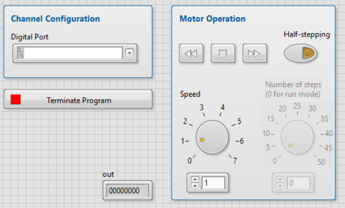
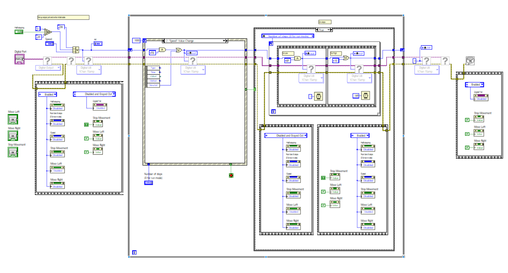

# LV Stepper Motor

This is a project I built in LabVIEW to provide control for a stepper motor. Input via a GUI was conveyed to hardware which generated electrical signals for control of the device.

## Control Panel GUI

## Program Logic

